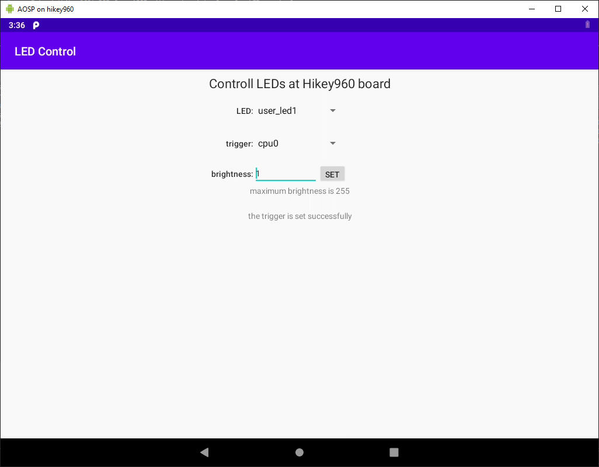

# Practical work

Extend `hikey960` BSP from AOSP with custom interface for LEDs control.

Solution should include:
- forked AOSP manifest extended with modified projects and custom projects;
- patched kernel
(kernel building should be integrated into Android build);
- extended BSP project to include custom SW components;
- HAL: interface definition in HIDL and implementation (binderized service);
- Java service with access to the HAL above and defined interface in AIDL;
- Java GUI application with access to Java service above;

All custom components should be located in `vendor` subtree and built as vendor modules.  
Communication between java application, java service and HAL should be via binder.  
For custom components should be defined SELinux contexts and rules.

For review extend this readm with description of your solution
which will include lincs to all its components.

# Result of the Homework:
## List of repositories:
- [Android repo manifest](https://github.com/Coolbash/android_manifest/tree/gl-hikey960-2020). 
- [Patched Kernel](https://github.com/Coolbash/hikey-linaro-kernel/tree/gl-hikey960-4.9-2020).
- [BSP for hikey960](https://github.com/Coolbash/hikey-linaro-device/tree/gl-hikey960-2020). 
- [LED control application with a java-service and a HAL-daemon](https://github.com/Coolbash/hikey-linaro-led).

There is no repository for HDMI proprietary hikey960 binaries. One should download and install it proper way.

All repositories are included in the repo manifest.

## LED control application:

The application shows list of all LEDs at the board. And for any chosen LED it shows its trigger, current brightness and maximum brightness.

User can change trigger and brightness of any LED. After changing, the program reads and shows changed value from the LED.

Remember, that brightness can change very often depending at trigger but the program shows only once-read value.

Values (trigger, brightness and max brightness) are read at selecting the new LED from the LED selection spinner.

